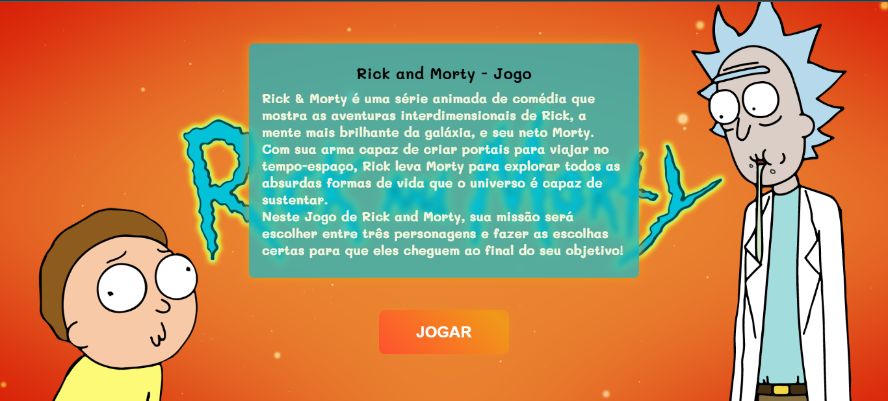

# Rick-And-Morty-Jogo

<h1>Projeto de encerramento do módulo 1 na Resilia Educação: Jogo de escolhas
</h1>

<h1> Tecnologias Utilizadas</h1>
<table>
  <thead>
    <tr>
      <th>HTML5</th>
      <th>CSS3</th>
       <th>Javascript</th>
    </tr>
  </thead>
   <tbody>
    <tr>
      <td>
      
 &nbsp;
      </td>
      <td>
          &nbsp;
      </td>
       <td>
          &nbsp;
      </td>

<h1>Detalhes do projeto</h1>
<h2>Mecânica:</h2>

O jogo tem como mecanismo principal de funcionamento as escolhas feitas pelo usuário. 
     Elas deverão levar o jogador, com o personagem escolhido através de toda uma narrativa. 
     Diferentes narrativas e fins podem ser implementados para os diferentes personagens jogáveis. A ideia principal é que diversos cenários e escolhas resultem em "game over" e alguns poucos resultem em um final de sucesso. 

 <h2>Requisitos:</h2>

O jogo implementado será textual! Todo mecanismo de interação entre jogador e jogo deve ser feito através do prompt.

-  Deve ser possível jogar com ao menos 3 personagens diferentes
 - Ao menos 3 etapas/fases devem ser implementadas para cada personagem 
 - Os textos da narrativa devem ser apresentados na página HTML 
 -  A verificação da entrada de dados do usuário deve ser realizada utilizando estruturas de repetição 

- Estruturas condicionais devem ser utilizadas para guiar o jogador pela narrativa

- Cada etapa/fase deve ser implementada em um arquivo diferente

- Funções devem ser criadas e utilizadas para uma maior e melhor legibilidade do código 

- O projeto desenvolvido deve ser fornecido em repositório no Github 

- Os grupos devem organizar uma apresentação (slides) que será utilizada no dia e entregue no último encontro do módulo.

<h2>Slide da apresentação do projeto no canvas</h2>
        
| https://www.canva.com/design/DAE_E03l5Gg/UXDrX90JGQBEC26FEEuvkA/edit

<h2>Fotos de algumas partes do jogo</h2>

